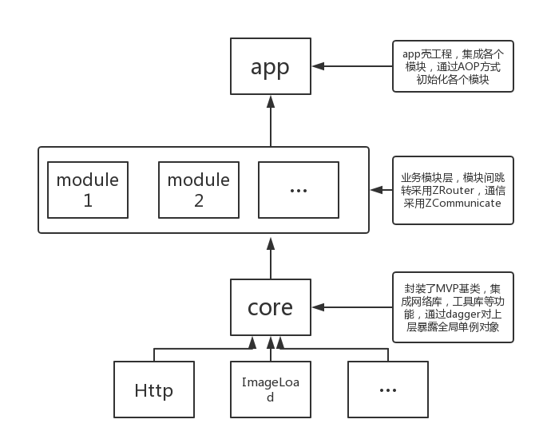

# ZComponent
MVP+Dagger2组件化框架

### 整体框架

**core** - 业务底层框架，MVP基类，集成各个底层框架如网络，图片加载库等等，通过dagger2对上层提供工具类，上层业务模块可依赖注入需要使用的对象

**业务模块** - 模块间没有依赖，通过[ZRouter](https://github.com/kingJ430/ZRouter)来跳转，模块间数据交互使用ZCommunicate来处理，并且各个业务模块可以单独运行

**主工程** - 集成各个业务模块，本身是一个业务模块，通过AOP方式在Application中插入各个业务模块的初始化代码，不要强依赖
